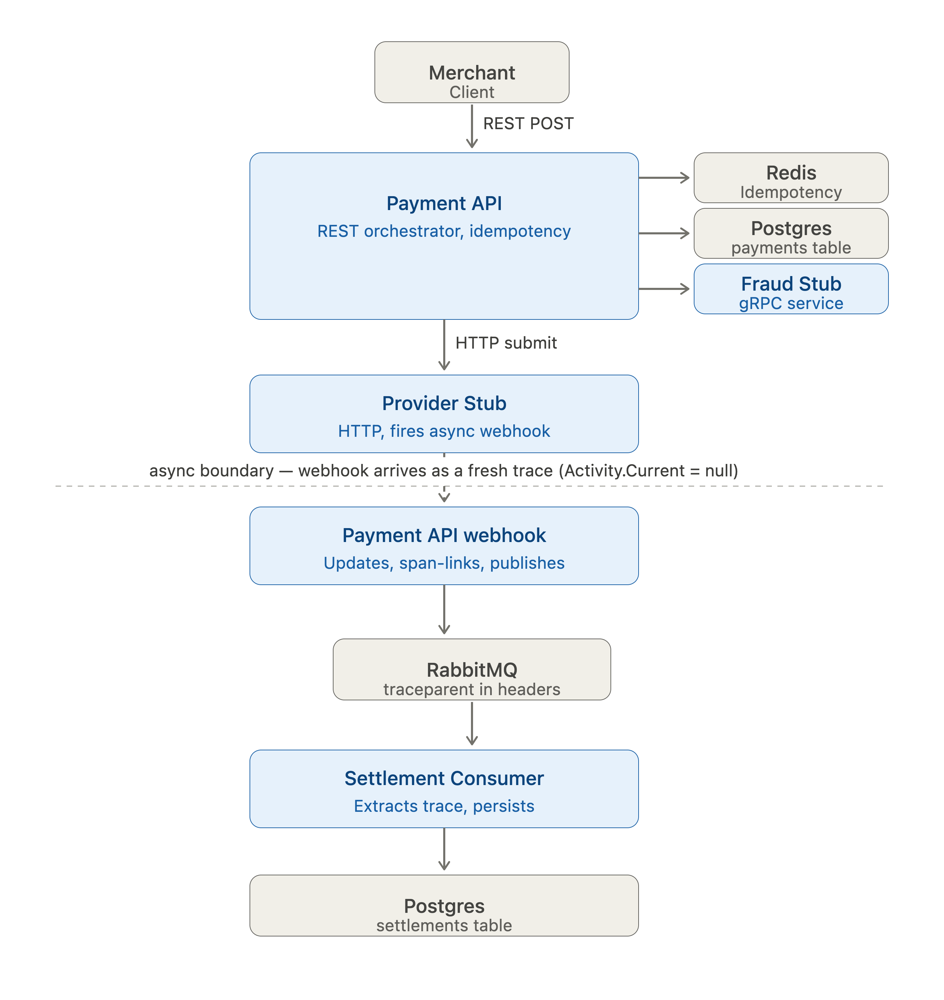
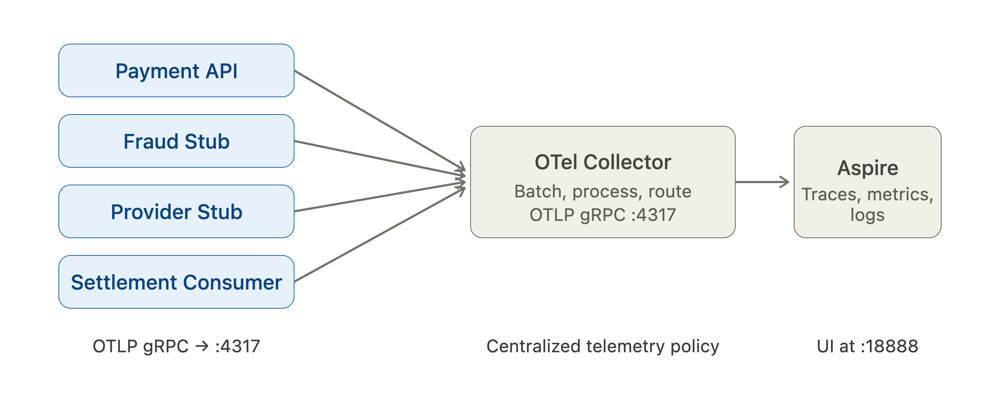

# PayBridge — Observable Payment Processing Service

A multi-service payment orchestrator built around end-to-end distributed
tracing across six protocol boundaries, with race-proof correctness under
async failure modes.

This README is organized to match the structure of `Dotnet_Assignment_SDE2.pdf`
so it's easy to verify coverage section by section.

---

## Quick start

**Requirements:** Docker Desktop with ≥6 GB RAM allocated.

```bash
git clone https://github.com/sitesh221b/paybridge.git
cd paybridge
docker compose up -d --build
```

First build is ~3 minutes (Rosetta emulation on Apple Silicon — see note below).
Then:

- **Send a payment**: open [`requests.http`](./requests.http) in VS Code with
  the REST Client extension, or:
```bash
  curl -X POST http://localhost:5001/api/payments \
    -H "Content-Type: application/json" \
    -d '{"merchantId":"acme","idempotencyKey":"k1","amount":49.99,"currency":"USD","customerEmail":"[email protected]","method":"CreditCard","metadata":null}'
```
- **See the trace**: [http://localhost:18888](http://localhost:18888) → Traces
- **See the queue**: [http://localhost:15672](http://localhost:15672) (guest / guest)
- **Inspect data**:
```bash
  docker exec -it paybridge-postgres psql -U paybridge -d paybridge \
    -c "select * from payments order by created_at desc limit 5;"
```

> **Apple Silicon note**: the four .NET service containers are pinned to
> `platform: linux/amd64`. `Grpc.Tools` segfaults inside arm64 Docker
> images during protoc codegen, and Rosetta sidesteps that cleanly. On
> amd64 hosts (most CI runners and most reviewer machines), the services
> run natively.

---

## Architecture



The system has two phases:

1. **Synchronous request path** (top of diagram). Payment API validates the
   request, checks Redis + Postgres for idempotency, calls Fraud over gRPC,
   persists the row, and submits to the Provider over HTTP. All in one trace.

2. **Async settlement path** (below the dashed boundary). Provider fires a
   webhook callback as a fresh HTTP request, with the trace context
   deliberately severed in the provider stub to model real third-party
   behavior. The webhook handler creates a span with a link back to the
   original payment trace, then publishes a `PaymentEvent` to RabbitMQ. The
   traceparent is manually injected into message headers so the Settlement
   Consumer's span lands as a child of the publisher's span across the queue.



All four .NET services export OTLP to an OpenTelemetry Collector, which
forwards to the Aspire Dashboard. Telemetry policy (sampling, scrubbing,
multi-backend routing) lives in the Collector config, not in app code.

---

## Section 3A — Services

| # | Component | Implementation |
|---|---|---|
| 1 | Payment API (REST) | Fully implemented. Validation, idempotency, gRPC fraud call, HTTP provider call, webhook handler, event publishing |
| 2 | Fraud Detection (gRPC) | Stub. Real gRPC server using the assignment's proto schema verbatim, returns random approve/reject (~15% rejection) |
| 3 | Payment Provider (HTTP) | Stub. Accepts the submission, fires an async webhook callback with `Activity.Current = null` so the callback arrives without trace context (simulating a real provider) |
| 4 | Webhook Receiver | Fully implemented. Endpoint on Payment API, idempotent against duplicate delivery, span-linked back to the original payment trace |
| 5 | Message Queue | RabbitMQ. Assignment allows alternatives; chose Rabbit for the single-container footprint and built-in management UI. The trace propagation pattern is identical to Kafka |
| 6 | Settlement Consumer | Fully implemented. Background worker that manually extracts trace context from message headers and persists settlements idempotently (unique index on `PaymentId`) |
| 7 | Cache (Redis) | Fully implemented. Idempotency fast path; falls back to Postgres if unavailable |

---

## Section 3B — Deployment

`docker compose up -d --build` brings up:

- 4 .NET service containers (Payment API, Fraud Stub, Provider Stub, Settlement Consumer)
- PostgreSQL (system of record)
- Redis (idempotency cache)
- RabbitMQ (event broker + management UI)
- OpenTelemetry Collector (telemetry pipeline)
- Aspire Dashboard (traces, metrics, logs in one UI)

All services communicate over Docker's internal network. Telemetry flows
app → Collector → Dashboard, so a reviewer can send one payment and watch
a single trace span six protocol boundaries.

---

## Section 3C — Observability

### B1: Distributed tracing

> *How do you propagate trace context across each of these protocol boundaries?*

| Boundary | Mechanism |
|---|---|
| Inbound REST (merchant → Payment API) | Auto-instrumented (`OpenTelemetry.Instrumentation.AspNetCore`). Reads `traceparent` or starts a new trace |
| Outbound gRPC (Payment API → Fraud) | Auto-instrumented (`OpenTelemetry.Instrumentation.GrpcNetClient`). Injects `traceparent` into gRPC metadata |
| Outbound HTTP (Payment API → Provider) | Auto-instrumented (`OpenTelemetry.Instrumentation.Http`). Injects `traceparent` into HTTP headers |
| Database queries | Auto-instrumented (`OpenTelemetry.Instrumentation.EntityFrameworkCore`, `StackExchangeRedis`) |
| Webhook callback (Provider → Payment API) | Manual relinking via span links. Details below |
| Queue publish + consume | Manual inject/extract of `traceparent` into RabbitMQ message headers. Details below |

> *What happens when the webhook callback arrives as a completely separate
> HTTP request — how do you link it back to the original payment trace?*

When Payment API calls the Provider, it captures the current trace context
(`Activity.Current.TraceId` and `SpanId`) and persists them on the payment
row. The Provider stub then fires the webhook from a background task with
`Activity.Current = null`, which models how a real third-party provider
calls us back — from a different process, with no shared in-memory trace.

The webhook handler reads the stored TraceId/SpanId from the database and
creates an `ActivityKind.Internal` span with an `ActivityLink` pointing
back to the original context. The Aspire Dashboard renders this as a
clickable cross-trace pivot.

I chose span links rather than treating the webhook as a child of the
original payment span. Parent-child implies synchronous nesting in one
trace tree; a link expresses "two separate traces, causally related"
honestly. That matches what's actually happening — async callback, not
nested call.

Implementation in `Controllers/WebhooksController.cs`.

### B2: Custom metrics

> *What types of metrics (counters, histograms, gauges) are appropriate for
> each measurement? How do you keep tag/label cardinality under control?*

Defined in `Observability/PaymentMetrics.cs`:

| Metric | Type | Labels | Reason |
|---|---|---|---|
| `paybridge.payments.total` | Counter | status, method, currency | Count payments by outcome; rate derives at query time |
| `paybridge.payments.duration` | Histogram | status, method, currency | Latency distribution for the latency SLO. Averages hide the tail; histograms give percentiles |
| `paybridge.payments.in_flight` | UpDownCounter | none | Current concurrency for saturation alerts |
| `paybridge.fraud.outcomes` | Counter | outcome (approved/rejected) | Fraud approval rate tracking |
| `paybridge.idempotency.replays` | Counter | source (cache/db) | Idempotency hit rate by tier |
| `paybridge.resilience.breaker_events` | Counter | transition (opened/closed/half_opened) | Circuit-breaker state transitions, used in SLO 3 |

Cardinality is the trap. Every label is a bounded categorical value — a
closed enum or a small known set. PaymentId, email, and raw amount never
appear as labels; they go on traces (for drill-down) and on logs (for
queries) but not on metrics, where they'd create unbounded time series and
inflate cost.

### B3: Health checks

> *Not all dependency failures are equal — which dependencies are critical
> vs. nice-to-have? How should the health check response reflect this?*

| Endpoint | Behavior |
|---|---|
| `GET /health/live` | Always 200 if the process responds. No external dependency checks — a transient DB blip must not cause a restart loop |
| `GET /health/ready` | 200 if critical dependencies (Postgres, RabbitMQ) are healthy. 200 with `Degraded` if non-critical dependencies fail. 503 if a critical dependency is down |

How I drew the line:

- Postgres down → 503. We're the system of record; without it we can't
  fulfill our contract.
- RabbitMQ down → 503. We can't guarantee event publication.
- Redis down → 200 Degraded. The DB unique constraint is the durable
  idempotency guarantee; Redis is a fast-path optimization. Falling back
  to DB lookups is slower but correct.
- Fraud service down → handled by the circuit breaker, not the health
  check. The breaker fails closed (intentional — we don't process payments
  when fraud can't be evaluated), which surfaces as the right business
  signal: payments fail with `fraud_service_unavailable`, not the API
  itself being unready.

Try it:

```bash
docker compose stop redis      # /health/ready → 200 Degraded
docker compose stop postgres   # /health/ready → 503 Unhealthy
docker compose start redis postgres
```

### B4: Structured logging

> *How do you correlate logs with traces? What should and should not appear
> in production logs?*

All logs are structured JSON. `AddOpenTelemetry()` on the logging pipeline
stamps every line with `TraceId` and `SpanId` from the current `Activity`,
so the dashboard's Logs tab shows a TraceId column on every row — click it
and you're on the matching trace.

What I log: lifecycle events (payment received, fraud check completed,
payment created, webhook processed, settlement persisted), decision points
(payment rejected with reason, idempotent replay served, circuit breaker
opened/closed), and system identifiers (`MerchantId`, `PaymentId`,
`ProviderTransactionId`).

What I deliberately don't log: customer emails, card data or CVV (these
never enter the service by design), auth tokens, raw request bodies.

Framework log noise (HttpClient request lifecycle, EF Core SQL command
verbosity) is dampened to Warning in `appsettings.json` so the structured
logs view stays focused on business events.

---

## Section 3D — Resilience

> *What happens when a payment provider is down?*

Polly v8 resilience pipeline on the fraud gRPC client:

- Per-attempt timeout of 2s, and an outer 10s timeout bounding the whole
  operation. Two layers because they protect against different failure
  modes — one slow downstream can otherwise eat the whole retry budget on
  the first attempt
- Retry with exponential backoff and jitter (3 attempts). Jitter avoids
  thundering herd on downstream recovery
- Circuit breaker — opens at 50% failure rate over a 10s rolling window
  after a minimum throughput of 5 requests, break duration 15s. While open,
  subsequent calls fail fast instead of piling onto a dying dependency
- Every state transition emits a metric (`paybridge.resilience.breaker_events`)
  and a domain warning log on `OnOpened`

Demo:

```bash
docker compose stop fraud-stub
for i in {1..6}; do
  curl -X POST http://localhost:5001/api/payments \
    -H "Content-Type: application/json" \
    -d "{\"merchantId\":\"acme\",\"idempotencyKey\":\"brk-$i\",\"amount\":1,\"currency\":\"USD\",\"customerEmail\":\"[email protected]\",\"method\":\"CreditCard\",\"metadata\":null}"
done
```

First 4–5 fail slowly (~6s each, with backoff). Breaker trips. Subsequent
requests fail in <100ms. The dashboard's Logs tab shows
"Fraud circuit breaker OPENED".

> *What happens when the message queue is unavailable?*

In this submission the webhook handler publishes inline — if the broker is
down, the publish fails and the payment is left in `Completed` in Postgres
with no settlement event. That's a real dual-write inconsistency. The
production answer is the **Outbox pattern**: write the event to an `outbox`
table inside the same DB transaction as the status update; a relay polls
that table and publishes. Guarantees "persisted ⇔ will-be-published"
without distributed transactions. Documented as a production extension in
[docs/design.md](docs/design.md).

> *How do you handle duplicate webhook callbacks?*

The webhook handler is idempotent: if the payment's status is already
`Completed` or `Failed`, return 200 with `"already_processed"`. Provider
re-deliveries become no-ops.

> *How do you handle duplicate payment creation requests (same idempotency key)?*

Three layers, ordered fastest-to-most-durable:

1. **Redis fast path**. `(merchant_id, idempotency_key)` → existing PaymentId
   lookup, sub-millisecond. Most duplicates short-circuit here.
2. **Postgres durable check**. `SELECT` by composite key — slower but truth.
3. **Postgres unique constraint**. `(merchant_id, idempotency_key)` is a unique
   index. Even under a race between two requests, only one INSERT succeeds;
   the loser catches the unique violation (`SQLSTATE 23505`) and returns the
   winner's record.

Redis is an optimization. The DB constraint is the durable guarantee. Cache
can be lost without correctness loss.

> *Can an operator disable payment processing without restarting the service?*

Not implemented in this submission, documented as a production extension.
The pattern: a config flag bound via `IOptionsMonitor<T>` so it hot-reloads
without restart, checked at the controller entry, and surfaced as a gauge
metric so its state shows on the dashboard.

> *Every resilience mechanism should be observable.*

Circuit breaker state transitions emit metrics and logs. Retry attempts
surface in Polly's built-in `Polly` meter (registered alongside the custom
meter in OTel). Health check responses are JSON-structured per-dependency.
Idempotency replays emit a counter with the source layer (cache vs db) as
a label. The dashboard view of these is in screenshots under
[docs/screenshots/](docs/screenshots/).

---

## Section 3E — Testing

> *Write tests that give you confidence the service works correctly. Choose
> the testing levels, tools, and coverage that you believe are appropriate.
> Justify your choices.*

```bash
dotnet test
```

13 tests, all passing:

| Layer | Count | What |
|---|---|---|
| Unit | 8 | Validation predicates (theory tests with 5 invalid + 3 valid input combinations); status enum mappings |
| Integration (Testcontainers) | 4 | End-to-end orchestration paths against real Postgres + Redis |

Why integration-heavy: this service's primary value is correct *orchestration*
of external systems. Most failure modes — idempotency races, EF schema and
casing issues, traceparent header survival, resilience pipeline behavior —
involve at least two components. Unit-testing the controller in isolation
means mocking the DB, the gRPC client, and Redis, at which point I'm testing
that my mocks behave like my mocks rather than that the real system works.

Testcontainers gives near-unit-test speed (~5–10s after image caching)
against real Postgres and Redis, which has shifted the historical cost
trade-off. The gRPC fraud client and HTTP provider client are replaced with
in-process fakes — I test orchestration, not the external services.

What I'd add next, out of scope here:

- Webhook idempotency under simulated duplicate provider delivery
- End-to-end queue-propagation test (Testcontainers RabbitMQ + a sibling
  Settlement Consumer process)
- Contract test for the provider HTTP integration

---

## Section 3F — Design document

The full design document is in **[`docs/design.md`](docs/design.md)**, covering:

1. Architecture overview
2. Three SLOs (availability, latency, settlement freshness) with burn-rate alerting
3. Incident runbook for "payment success rate dropped"
4. PII and data governance — what we log/don't log, redaction, retention
5. Cost awareness at 1,000 payments/minute — tail sampling, cardinality
   discipline, retention tiering, the Collector as a cost-control point

---

## Tech stack and key decisions

| Decision | Why | What I'd do in production |
|---|---|---|
| .NET 10 LTS | Current long-term support (Nov 2025) | Same |
| Aspire Dashboard as backend | One container, three pillars in one UI, zero config | Tempo/Mimir/Loki via Collector exporters, or managed (Honeycomb/Datadog) |
| OpenTelemetry Collector in the pipeline | Apps stay dumb; telemetry policy centralizes (sampling, scrubbing, routing) | Same — Collector is the production-correct shape |
| PostgreSQL + EF Core | First-class OTel and Npgsql instrumentation; native ARM64 image on Apple Silicon | Same |
| RabbitMQ over Kafka | Single container, management UI; the trace propagation story is identical | Either, depending on team operational expertise |
| Raw `RabbitMQ.Client` rather than MassTransit | Made the manual inject/extract path explicit so the trace propagation story is in my code, not a library's | MassTransit or Wolverine — they wrap the same pattern |
| `Microsoft.Extensions.Http.Resilience` (Polly v8) | HTTP-aware defaults; integrates cleanly with `IHttpClientFactory` | Same |
| Migrations on app startup | Single-replica simplicity for the take-home | Migration runner job in CI, or `dotnet ef migrations bundle` sidecar — race-safe for rolling deploys |
| `Activity.Current = null` in the Provider stub's background task | Provider's `Task.Run` would otherwise inherit the inbound request's trace context via `AsyncLocal<T>`. Clearing it accurately models a real provider firing a webhook from a different process | N/A — real providers don't have access to our trace context |
| Apple Silicon `linux/amd64` pinning | `Grpc.Tools` arm64 protoc segfaults in Docker; Rosetta sidesteps it | Build on amd64 CI runners natively, or pre-generate proto code outside Docker |
| Validation predicates inlined in controller | Time trade-off; same predicate duplicated in test code | Extract to a `PaymentRequestValidator` shared via `PayBridge.Common` |

---

## Notes on AI tool usage

I used Claude (Anthropic) throughout the build, as a directed accelerator
rather than an autopilot.

What I delegated for speed:

- Initial scaffolding — Dockerfiles, docker-compose skeleton, OTel
  registration boilerplate, sample request files, README structure
- Translating the assignment's proto schema into wired-up gRPC client and
  server code
- The standard Polly v8 resilience pipeline shape
- Debugging help on specific errors I hit (a `Grpc.Tools` arm64 segfault,
  an `Activity.StartActivity` overload-resolution ambiguity, an EF Core
  casing issue in Postgres, a `ResilienceHandlerContext.ServiceProvider`
  lookup pattern I initially got wrong)

What I directed and verified rather than delegated:

- Which services to fully build vs. stub, where to spend depth vs. breadth
- The trace-relinking strategy (span links over parent-child)
- The decision to detach trace context with `Activity.Current = null` in
  the provider stub's background task
- Idempotency at three layers (cache fast path, DB durable check, unique
  constraint as the race-proof backstop)
- Health check critical-vs-non-critical boundary
- SLO definitions and alerting strategy
- PII handling model
- Test coverage scope

What broke and how I caught it:

- The model initially missed that
  `EntityFrameworkInstrumentationOptions.SetDbStatementForText` was
  removed in OpenTelemetry 1.13. Caught at build time.
- It suggested an Aspire Dashboard image tag (`1.15`) that didn't exist.
  Caught from the pull error.
- It wrote the wrong namespace prefix for `HttpRetryStrategyOptions` (Polly
  v8 moved it). Caught at build time.

These are exactly the staleness costs that come with AI speed — the
discipline is to verify each suggestion against the build and docs.

Net effect: AI compressed maybe a day of mechanical work, so my limited
evenings went into the observability and correctness story the assignment
is actually testing. Every code path here I can explain and defend.
